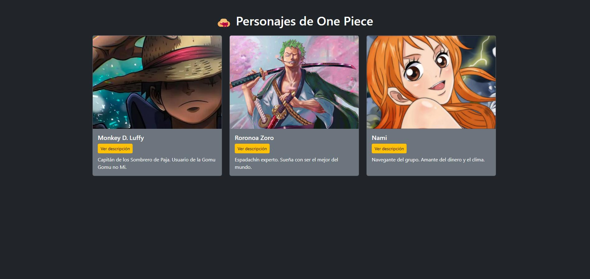

# Miniweb One Piece 🏴‍☠️

Miniweb desarrollada en PHP y MySQL que muestra una lista de personajes de One Piece. Usa Bootstrap para el diseño responsive y jQuery para interacciones.

## 🔧 Tecnologías
- PHP
- MySQL
- Bootstrap 5
- jQuery
- Git

## 📂 Estructura
- `index.php`: Página principal
- `conexion.php`: Conexión a la base de datos
- `script.js`: Efecto de mostrar/ocultar descripción
- `estilo.css`: Estilos personalizados
- `onepiece.sql`: Exportación de la base de datos

## 📷 Captura

